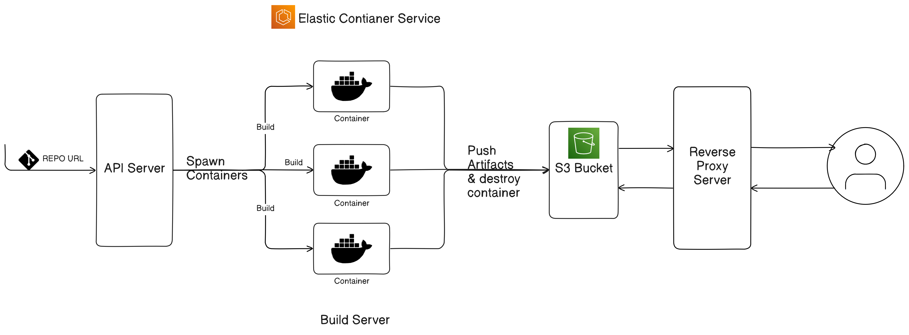

## Scale Mesh
Deploy your web apps with ease.

## Architecture


## Setup and run locally.

### Requirements
- Go version *go1.23.2*
- Install *air* package for live reload
    ```
    go install github.com/air-verse/air@latest
    ```

- Clone the repository.

1. Run the *api-server* (main backend server)
```
cd api-server
```
Install the dependencies

```
go mod download
```

Run the API
```
air --build.cmd "go build -o bin/api ./cmd/web/" --build.bin "./bin/api"
```

this API will start at port 9000, check the api at ```127.0.0.1:9000/health```.

2. Run the reverse-proxy API

```
cd reverse-proxy
go mod download
air --build.cmd "go build -o bin/api ./cmd/web/main.go" --build.bin "./bin/api"
```
3. Build the *build-server* container

## Structure

### API-Server

#### Endpoints
- ***GET*** ```/health``` to check health of the API.
- ***POST*** ```/project``` to build the project.


## Components
1. ***Build Server***

2. ***Reverse Proxy***

3. ***API Server***

4. ***Frontend Server***

4. ***Log Collection Pipeline***

5. ***Socket Server Log Subscription***

## Build Server
To build the code and push the artifacts to the S3 bucket.

### How it works?
It is a custom Docker container which uses the GitHub repo url, clones it and then build it and push them to SS3 bucket

***Structure***
- Dockerfile
- entry.sh
- main.go

> It is a Multistage Docker build, which builds the Go binary in first stage and then run it in 2nd stage to build the user's web app code.

Build Server image is pushed to AWS ECR, and then a ECS cluster & Task defination are created to run a container from the ECR image, and after task completed, it'll destroy the container.


S3 buckets are uploaded in this path - *__output/{projectID}/* 

## API Server
Main backend API, which takes the GitHub repository URL from the user and start the ECS task.

## Frontend Server
Serve a basic HTML template for user to interact with the application.

## Reverse Proxy
To serve the user Web App dynamically using the unique project id.

> Work in progress, currently it just redirects to the s3 url.
